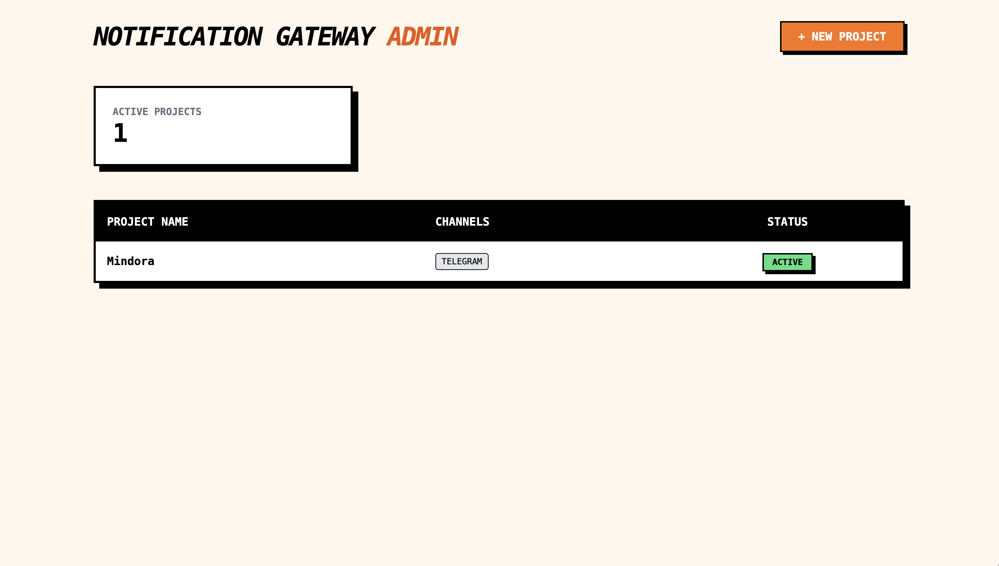
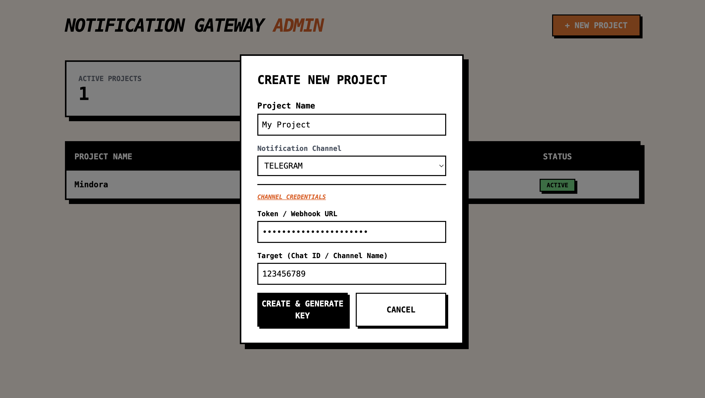

# Notification Gateway

A high-performance Reactive Notification Gateway built with Quarkus.

## Core Concept
Centralize your alerts. One API to rule them all (Telegram, Discord, etc.).

## Tech Stack
- Backend: Java (Quarkus), Hibernate Reactive, Mutiny.
- Frontend: Qute, Tailwind CSS.

## Preview
 | 

## API Usage
**POST** `/v1/notify`

```json
{
  "apiKey": "uuid-here",
  "message": "System Alert!",
  "severity": "ERROR"
}
```

## Setup
1. docker-compose up -d
2. ./gradlew quarkusDev
3. Web: localhost:8080/admin